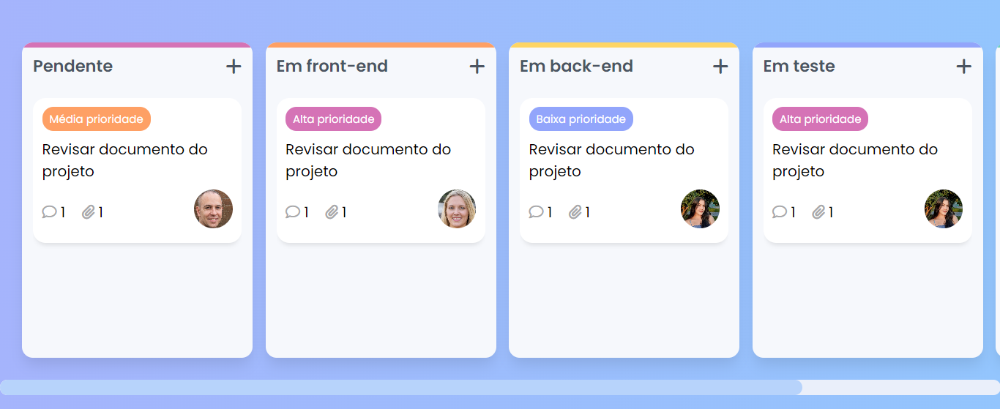

# KANBAN FRONTEND
👨‍💻SITE KANBAN INTERATIVO COM EFEITO DE ARRASTA E SOLTA USANDO HTML, CSS E JAVASCRIPT. 

  

## DESCRIÇÃO:
Este é um site de **Kanban**, uma ferramenta visual para organizar e gerenciar tarefas em diferentes etapas de um fluxo de trabalho. Ele permite adicionar cartões de tarefas em colunas, representando o progresso como "Pendente", "Em front-end", "Em teste", etc. 

Cada tarefa pode ser arrastada entre colunas para indicar seu status. O usuário pode adicionar novas tarefas clicando no ícone de "+" e movimentá-las entre as colunas arrastando e soltando. A interface é organizada de forma clara e responsiva, com prioridades visíveis e avatares dos responsáveis por cada tarefa.

## NÃO SABE?
- Entendemos que para manipular arquivos em `HTML`, `CSS` e outras linguagens relacionadas, é necessário possuir conhecimento nessas áreas. Para auxiliar nesse aprendizado, oferecemos cursos gratuitos disponíveis:
* [CURSO DE HTML E CSS](https://github.com/VILHALVA/CURSO-DE-HTML-E-CSS)
* [CURSO DE JAVASCRIPT](https://github.com/VILHALVA/CURSO-DE-JAVASCRIPT)
* [CONFIRA MAIS CURSOS](https://github.com/VILHALVA?tab=repositories&q=+topic:CURSO)

## CREDITOS:
- [PROJETO CRIADO PELO "Larissakich"](https://github.com/Larissakich/kanban-frontend)
- [VEJA O VIDEO DESSE PROJETO](https://youtu.be/BthF7gc5S7g?si=TaK7rKJ_ei47kHv9)
- [PROJETO EDITADO PELO VILHALVA](https://github.com/VILHALVA)